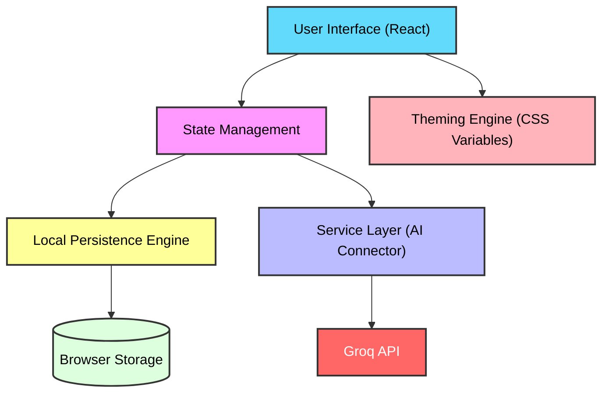

# Lexis AI — Dictionary Workstation

[](https://reactjs.org/)
[](https://vitejs.dev/)
[](https://www.typescriptlang.org/)
[](https://opensource.org/licenses/MIT)
[](https://github.com/M-Affan01/AI-Dictionary)

> **Lexis AI** is an enterprise-grade linguistic workstation powered by artificial intelligence. It transcends traditional lexicography by offering deep etymological analysis, semantic mapping, and contextual usage insights through a high-fidelity, mission-critical dashboard.

---

## Project Overview

In an era of rapid information exchange, the depth of language often gets lost in superficial definitions. **Lexis AI** is designed to bridge the gap between simple word lookups and academic-level linguistic research. By leveraging high-speed **Groq LPU™ Inference Engine**, the workstation provides not just meanings, but the historical evolution (etymology), synonyms, antonyms, and complex sentence structures for any given term.

Whether you are a researcher, a developer, or a linguistics enthusiast, Lexis AI offers a "Command Center" experience for exploring the intricacies of human language.

---

## Core Features

### AI-Driven Intelligence
- **Deep Etymology**: Trace the roots of words across centuries and cultures.
- **Semantic Mapping**: Real-time generation of synonyms and antonyms with contextual relevance.
- **Ultra-Fast Synthesis**: Sub-second processing of linguistic data powered by Groq's Llama-3 models.

### Advanced Workstation Tools
- **Persistence Engine**: Integrated `localStorage` system for tracking Search History and Favorite terms.
- **Telemetry Dashboard**: A high-fidelity UI providing real-time feedback and state transitions.
- **Responsive Architecture**: Fully optimized for desktop, tablet, and mobile workflows.

---

## System Architecture

Lexis AI follows a strictly decoupled architecture to ensure scalability and maintainability.



---

## Technical Stack

| Category | Technology | Version |
| :--- | :--- | :--- |
| **Frontend Framework** | React | 18.x |
| **Build Tool** | Vite | 5.x |
| **Language** | TypeScript | 5.x |
| **AI Integration** | Groq Cloud SDK | Latest |
| **Styling** | Vanilla CSS3 (Custom Variables) | - |
| **Icons** | Lucide React | Latest |

---

## Quick Start

### Prerequisites
- Node.js (v18 or higher)
- npm or yarn
- A [Groq Cloud API Key](https://console.groq.com/keys)

### Installation

1. **Clone the Repository**
   ```bash
   git clone https://github.com/M-Affan01/AI-Dictionary.git
   cd AI-Dictionary
   ```

2. **Install Dependencies**
   ```bash
   npm install
   ```

3. **Configure Environment**
   Create a `.env` file in the root directory:
   ```env
   VITE_GROQ_API_KEY=your_groq_api_key_here
   VITE_APP_URL=http://localhost:3000
   ```

4. **Run Development Server**
   ```bash
   npm run dev
   ```

---

## Usage Guide

1. **Initialize Search**: Enter any word into the primary input field on the dashboard.
2. **Analyze Results**: Review the AI-synthesized definitions, etymology, and semantic relationships.
3. **Save to Favorites**: Click the "Heart" icon to persist important words for later review.
4. **Track History**: Access the "History" panel to see your recent linguistic explorations.

---

## License

Distributed under the **MIT License**. See [LICENSE](LICENSE) for more information.

---

## Contact

**Affan Nexor**
- **Project Lead:** Muhammad Affan
- **GitHub**: [@M-Affan01](https://github.com/M-Affan01)


